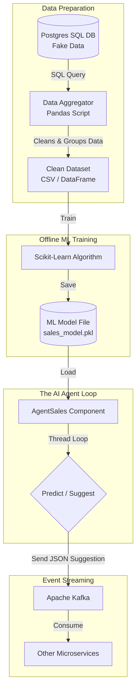

# Machine Learning Integration Guide for AgentSales

This guide breaks down exactly what your tutor is asking for, how to architecture it within the Elpida framework, and what type of Machine Learning (ML) fits your use case.

---

## 1. The Big Picture (Architecture Diagram)

As a beginner, it is much easier to understand how things connect visually. Here is the exact flow of data through your application, from the raw SQL database all the way to Kafka.

### What is happening here?
1. **Data Preparation:** Raw database tables are usually too messy. The **Aggregator** cleans it up into a nice spreadsheet-like format.
2. **ML Training:** You feed that clean data into an algorithm so it learns patterns. You save its "brain" as a `.pkl` file.
3. **The AI Agent:** Your Python script loads the "brain" (`.pkl`). While it runs in the background, it uses the brain to make live suggestions.
4. **Event Streaming:** Instead of writing the suggestions back to Postgres, the Agent fires a message to **Kafka**. Kafka is basically a giant loudspeaker that yells the suggestion out so any other app can hear it instantly.

---

## 2. Beginner Resources & References
Since you are a beginner, do not try to learn all of this at once! Take it one step at a time using these highly recommended resources:

### Step 1: Learn "Pandas" (For the Aggregator)
Pandas is the Python library you will use to pull SQL data and clean it up.
- **Video:** [Pandas Data Science Tutorial (Corey Schafer)](https://www.youtube.com/watch?v=ZyhVh-qRZPA)
- **Interactive:** [Kaggle Pandas Course (Free)](https://www.kaggle.com/learn/pandas)

### Step 2: Learn Basic Machine Learning (Scikit-Learn)
Your tutor wants you to do "Supervised Learning". Scikit-learn is the easiest library for this.
- **Concept Video:** [Machine Learning in 10 Minutes (StatQuest)](https://www.youtube.com/watch?v=Gv9_4yMHFhI)
- **Python Video:** [Scikit-Learn Crash Course (Programming with Mosh)](https://www.youtube.com/watch?v=7eh4d6sabA0)
- **Interactive:** [Kaggle Intro to Machine Learning](https://www.kaggle.com/learn/intro-to-machine-learning)

### Step 3: Learn Apache Kafka
Kafka can be intimidating, but you only need to learn the "Producer" part (sending messages).
- **Video:** [What is Apache Kafka? (Confluent)](https://www.youtube.com/watch?v=06iRM1vI8G0)
- **Python Code Example:** [Kafka-Python Tutorial](https://towardsdatascience.com/kafka-python-explained-in-10-lines-of-code-800e3e07dad1) *(Note: in your Elpida framework, you will create a `KafkaProducer` Component to run this code!)*

---

## 3. What Type of Machine Learning Should We Use?
Since this is an "Agent Sales" that provides "results or suggestions", you are building a **Predictive Model**.

Because you are using fake data with the exact same SQL columns as production, your ML type will be **Supervised Learning**.
- **Supervised Learning** means you train the model on historical data that already has the "answers" (e.g., past sales, customer behavior). 
- **Algorithms to explore:**
  - *Random Forest Classifier*: Great for predicting "Will this customer buy this product? (Yes/No)".
  - *XGBoost*: A very popular, slightly more advanced version of Random Forest.

---

 ### The New Folder Structure:

    Elpida-stage/
    ├── agent/
    │   └── sales.py          <-- 3. The live AI Agent (Loads the brain and predicts)
    ├── database/
    │   └── postgres.py       <-- Existing database component
    ├── ml/                   <-- NEW FOLDER: All ML logic goes here!
    │   ├── aggregator.py     <-- 1. Fetches SQL, cleans it, saves to CSV
    │   └── train.py          <-- 2. Reads CSV, trains the model, saves the "Brain" (.pkl)
    └── main.py

  ### The Code Flow (How you will build this):

  Step 1: The Aggregator ( ml/aggregator.py )
  I just created this file for you in your project! Open it up and take a look. It is a standalone Python script. It
  doesn't run with the rest of your app; you only run it when you want to prepare data.

  • It connects to Postgres.
  • It pulls the fake SQL data using  pandas .
  • It cleans it and saves a fresh  training_data.csv  file.
  (Note: I left comments in the file where you will type out the exact SQL queries once your tutor gives you the SQL
  file!)

  Step 2: Training ( ml/train.py )
  Once you have  training_data.csv , you will create a second standalone script. This script loads the CSV, trains the
  Random Forest algorithm (Scikit-Learn), and saves the trained model into a file called  sales_model.pkl .

  Step 3: The Live Agent ( agent/sales.py )
  This is the file you already have! You will update the  onEnterLoopBefore()  method in this file to load
  sales_model.pkl . Now, while your agent is running its background thread loop, it has a "brain" it can use to make
  suggestions and send them to Kafka!

  ### What you should do right now:

  Look at  ml/aggregator.py . To make this work, you need the  pandas  library. Run this command in your terminal to
  install it:

    pip install pandas psycopg2-binary

## 4. The "Master Prompt" for Claude / ChatGPT
Copy and paste this exact prompt into Claude or ChatGPT to get a deep-dive tutorial tailored exactly to your level and project.

> **Prompt:**
> "I am a beginner software engineering intern working on a Python framework based on a dynamic Component architecture with Dependency Injection. My current task is to build a Machine Learning 'Sales Agent' microservice. 
> 
> Here are the requirements my tutor gave me:
> 1. We will use Supervised Learning on fake data (but with production-identical SQL tables).
> 2. I need to build a 'Data Aggregator' using Pandas to prepare the SQL data for the ML model.
> 3. The Sales Agent will generate suggestions/predictions using Scikit-Learn.
> 4. The Agent must send these suggestions to an Apache Kafka topic so other microservices can consume them.
> 
> Can you please explain this to me like I am a beginner? Specifically:
> - Give me a very simple Pandas example of an Aggregator that groups SQL data.
> - Give me a simple Scikit-Learn example of training a RandomForest model and saving it.
> - How do I write a simple Kafka Producer in Python to send JSON messages?
> Please provide basic Python code examples for each part so I can understand how they connect."
